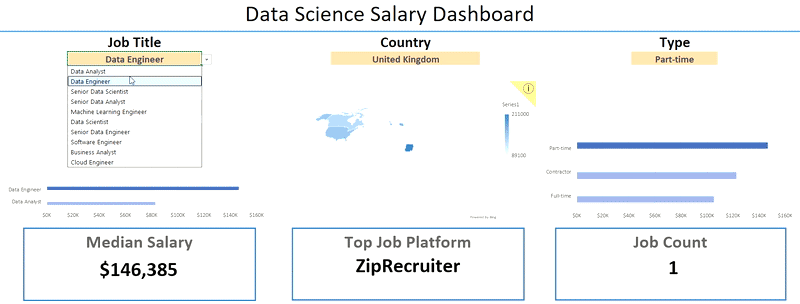

# Excel Salary Dashboard

## Salary Dashboard



## บทนำ
แดชบอร์ดข้อมูลเงินเดือนของสายงาน Data เพื่อช่วยให้ผู้หางานสามารถศึกษาข้อมูลเงินเดือนในตำแหน่งงานที่ต้องการ และตรวจสอบว่าได้รับค่าตอบแทนอย่างเหมาะสมหรือไม่

ข้อมูลนี้นำมาจากคอร์สเรียน Excel โดย [Luke Barousse](https://www.youtube.com/watch?v=pCJ15nGFgVg&t=17400s) ซึ่งเป็นพื้นฐานสำหรับการวิเคราะห์ข้อมูลด้วยเครื่องมือที่ทรงพลังนี้ โดยชุดข้อมูลประกอบด้วยรายละเอียดเกี่ยวกับชื่อตำแหน่งงาน เงินเดือน สถานที่ทำงาน และทักษะที่จำเป็น ซึ่งได้นำเสนอไว้อย่างครบถ้วนในแดชบอร์ดนี้

### สกิลของ Excel ที่ใช้

ทักษะใน Excel เพื่อนำมาใช้ในการวิเคราะห์

- 📈 Charts
- 🧮 Formulas and Functions
- ✅ Data Validation

### Data Jobs Dataset

Dataset ที่ใช้ในโปรเจกต์นี้ประกอบด้วยข้อมูลตำแหน่งงานด้าน Data Science จากโลกจริงในปี 2023 โดยสามารถเข้าถึงชุดข้อมูลนี้ได้ผ่านคอร์สเรียน Excel โดย [Luke Barousse](https://www.youtube.com/watch?v=pCJ15nGFgVg&t=17400s) ซึ่งเป็นพื้นฐานสำหรับการวิเคราะห์ข้อมูลด้วยโปรแกรม Excel ชุดข้อมูลนี้ประกอบด้วยรายละเอียดที่ครบถ้วนเกี่ยวกับ

- 👨‍💼 Job Titles
- 💰 Salaries
- 📌 Locations
- 🛠️ Skills

## การสร้างแดชบอร์ด

### **📈 Charts**

📊 **Data Science Job Salaries - Clustered Bar Chart**


1. **🛠️ ฟีเจอร์ของ Excel ที่ใช้**
    - ใช้แผนภูมิแท่งแบบแนวนอน (Bar Chart) และปรับรูปแบบการแสดงค่าจำนวนเงินเดือนให้ชัดเจน จัด Layout และองค์ประกอบต่างๆใน Chart เพื่อให้สื่อสารข้อมูลได้อย่างเป็นระเบียบเข้าใจง่าย

2. **🎨 การออกแบบและการจัดวางองค์ประกอบ**
    - ใช้แผนภูมิแท่งแนวนอนเพื่อให้เปรียบเทียบค่ามัธยฐานของเงินเดือนได้ง่ายและเห็นความแตกต่างอย่างชัดเจน

3. **📈 การจัดระเบียบข้อมูล**
    - จัดเรียงตำแหน่งงานตามลำดับเงินเดือนเป็นแบบจากมากไปน้อย เพื่อให้ผู้อ่านเข้าใจลำดับความสำคัญและแนวโน้มได้อย่างรวดเร็ว

4. **💡 ประเด็นเชิงลึกที่ได้จากการวิเคราะห์**
    - ระบุแนวโน้มได้ว่าอาชีพที่มีตำแหน่งระดับ Senior และอาชีพสายงาน Engineer มีรายได้สูงกว่าสาย Analyst อย่างมีนัยสำคัญ

🗺️ **Country Salaries - Map Chart**


1. **🛠️ ฟีเจอร์ของ Excel ที่ใช้**
    - ใช้ Map Chart เพื่อแสดงผลค่ามัธยฐานของเงินเดือนในแต่ละประเทศทั่วโลกที่มีอยู่ในชุดของข้อมูล

2. **🎨 การออกแบบและการจัดวางองค์ประกอบ**
    - ใช้แผนที่ทีมีการไล่เฉดสี เพื่อแยกระดับเงินเดือนตามภูมิภาคอย่างชัดเจน

3. **📊 การนำเสนอข้อมูล**
    - แสดงค่ามัธยฐานของเงินเดือนในแต่ละประเทศโดยอิงจากข้อมูลที่มีอยู่

4. **👁️ การปรับแต่งภาพให้โดดเด่นและน่าสนใจ**
    - เพิ่มความชัดเจนในการอ่านกราฟ และช่วยให้ผู้ใช้งานเข้าใจแนวโน้มเงินเดือนตามพื้นที่ต่าง ๆ ได้อย่างรวดเร็ว

5. **💡 ประเด็นเชิงลึกที่ได้จากการวิเคราะห์**
    - ช่วยให้มองเห็นความแตกต่างของเงินเดือนในระดับโลกได้ทันที พร้อมทั้งชี้ให้เห็นประเทศหรือภูมิภาคที่มีเงินเดือนสูงหรือต่ำอย่างเด่นชัด

### **🧮 Formulas and Functions**

#### 💰 Median Salary by Job Titles

```
=MEDIAN(
  IF(
    (jobs[job_title_short]=A2)*
    (jobs[salary_year_avg]<>0)*
    (jobs[job_country]=country)*
    (ISNUMBER(SEARCH(type, jobs[job_schedule_type]))),
    jobs[salary_year_avg]
  )
)
```

- **การกรองข้อมูลตามหลายเงื่อนไข (Multi-Criteria Filtering)**
    * มีการเช็คค่าข้อมูลของ job title, country, schedule type, และ นำค่าข้อมูลเงินเดือนที่เป็น 0 ออก

- **สูตรแบบอาร์เรย์ (Array Formula)**
    * ใช้ Function `MEDIAN()` ประกอบกับการใช้ Nested `IF()` เพื่อวิเคราะห์ค่าข้อมูลในอาร์เรย์

- **ข้อมูลเชิงลึกที่ปรับให้เหมาะกับผู้ใช้ (Tailored Insights)**
    * แสดงข้อมูลเงินเดือนแบบเฉพาะเจาะจงตามชื่อตำแหน่งงาน พื้นที่ทำงาน และประเภทของรูปแบบการทำงาน เพื่อให้ผู้ใช้งานสามารถเข้าถึงข้อมูลที่ต้องการได้อย่างแม่นยำ

- **วัตถุประสงค์ของการใช้สูตร (Formula Purpose)**
    * สูตรนี้ใช้ในการดึงค่ามัธยฐานของเงินเดือนจากตาราง โดยอ้างอิงจากชื่อตำแหน่ง ประเทศ และประเภทงานที่ผู้ใช้งานระบุ เพื่อแสดงผลในตารางด้านล่างอย่างถูกต้องและอัตโนมัติ

📋 Background Table


📈 Dashboard Implementation


#### 📆 Count of Job Schedule Type
```
= FILTER(J2#,NOT(ISNUMBER(SEARCH("and",J2#))) * (J2#<>0))
```
- **การสร้างรายการที่ไม่ซ้ำกัน (Unique List Generation)**
    * สูตร Excel ด้านบนนี้ใช้ฟังก์ชัน `FILTER()` เพื่อกรองรายการ โดยตัดข้อมูลที่มีคำว่า “and” ออก รวมถึงละเว้นค่าที่เป็นศูนย์

- **วัตถุประสงค์ของการใช้สูตร (Formula Purpose)**
    * สูตรนี้ใช้ในการสร้างตารางด้านล่าง เพื่อแสดงรายการประเภทตารางงาน (Job Schedule Types) ที่ไม่ซ้ำกัน


📋 Background Table


📈 Dashboard Implementation


### **✅ Data Validation**

#### **🔍 Filtered List**
- 🔒 **การตรวจสอบความถูกต้องของข้อมูลอย่างมีประสิทธิภาพ (Enhanced Data Validation)**

    การนำรายการที่ผ่านการกรองมาใช้เป็นเงื่อนไขในการตรวจสอบข้อมูล (Data Validation) ภายใต้หัวข้อ Job Title, Country และ Type ในแท็บ Data ช่วยให้เกิดประโยชน์ดังนี้
    * 🎯 จำกัดการกรอกข้อมูลของผู้ใช้ให้เป็นไปตามประเภทตารางงาน (Schedule Types) ที่กำหนดไว้เท่านั้น
    * 🚫 ป้องกันการกรอกข้อมูลที่ไม่ถูกต้องหรือไม่เป็นมาตรฐาน
    *  👥 เพิ่มความสะดวกในการใช้งานแดชบอร์ดโดยรวม และลดข้อผิดพลาดในการป้อนข้อมูล


## บทสรุป
ผมสร้างแดชบอร์ดนี้ขึ้นมาเพื่อฝึกฝนและเก็บสะสมผลงานเพื่อเข้ามาทำงานในสายงาน Data
โดยใช้ข้อมูลจากคอร์สเรียน Excel และ Workshop ของ **[Luke Barousse](https://www.youtube.com/watch?v=pCJ15nGFgVg&t=17400s)** และแดชบอร์ดนี้ช่วยให้ผู้ใช้งานสามารถตัดสินใจเกี่ยวกับเส้นทางอาชีพของตนได้อย่างมีข้อมูลรองรับ
ผู้ใช้งานสามารถสำรวจฟังก์ชันต่าง ๆ เพื่อทำความเข้าใจว่า “สถานที่ทำงาน” และ “ประเภทของงาน” ส่งผลต่อระดับเงินเดือนอย่างไร
