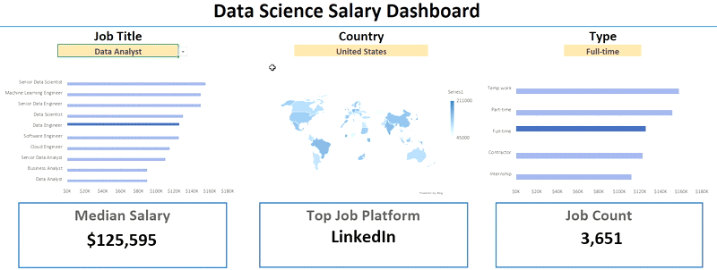
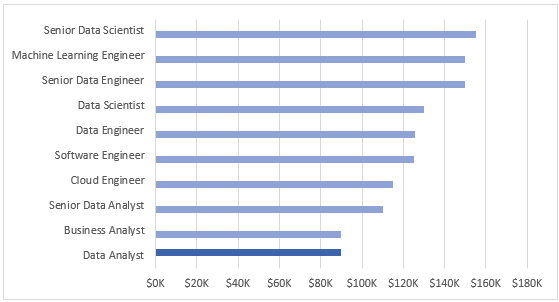
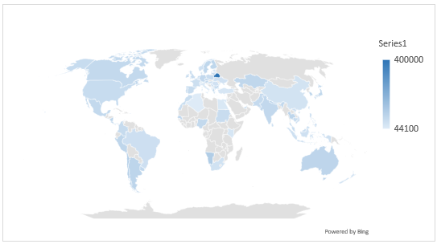
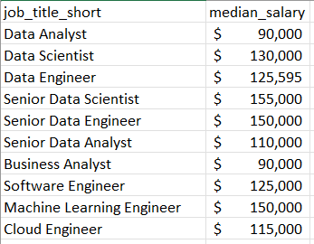
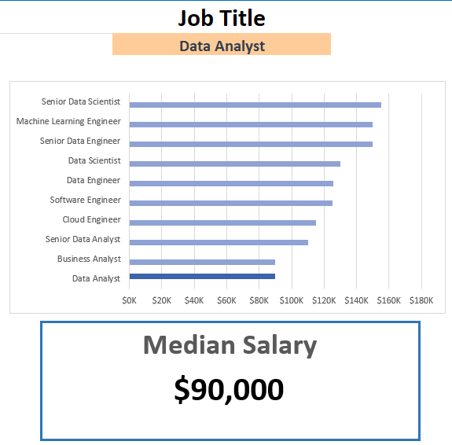
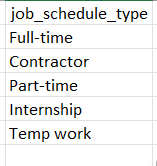
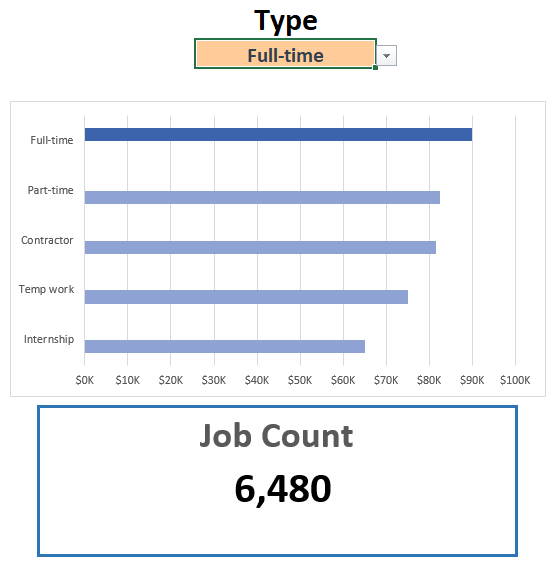
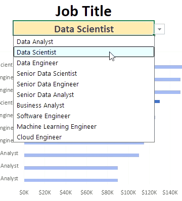

# Excel Salary Dashboard

## Salary Dashboard



## บทนำ
แดชบอร์ดข้อมูลเงินเดือนของสายงาน Data เพื่อช่วยให้ผู้หางานสามารถศึกษาข้อมูลเงินเดือนในตำแหน่งงานที่ต้องการ และตรวจสอบว่าได้รับค่าตอบแทนอย่างเหมาะสมหรือไม่

ข้อมูลนี้นำมาจากคอร์สเรียน Excel โดย Luke Barousse ซึ่งเป็นพื้นฐานสำหรับการวิเคราะห์ข้อมูลด้วยเครื่องมือที่ทรงพลังนี้ โดยชุดข้อมูลประกอบด้วยรายละเอียดเกี่ยวกับชื่อตำแหน่งงาน เงินเดือน สถานที่ทำงาน และทักษะที่จำเป็น ซึ่งได้นำเสนอไว้อย่างครบถ้วนในแดชบอร์ดนี้

### สกิลของ Excel ที่ใช้

ทักษะใน Excel เพื่อนำมาใช้ในการวิเคราะห์

- 📈 Charts
- 🧮 Formulas and Functions
- ✅ Data Validation

### Data Jobs Dataset

Dataset ที่ใช้ในโปรเจกต์นี้ประกอบด้วยข้อมูลตำแหน่งงานด้าน Data Science จากโลกจริงในปี 2023 โดยสามารถเข้าถึงชุดข้อมูลนี้ได้ผ่านคอร์สเรียน Excel โดย Luke Barousse ซึ่งเป็นพื้นฐานสำหรับการวิเคราะห์ข้อมูลด้วยโปรแกรม Excel ชุดข้อมูลนี้ประกอบด้วยรายละเอียดที่ครบถ้วนเกี่ยวกับ

- 👨‍💼 Job Titles
- 💰 Salaries
- 📌 Locations
- 🛠️ Skills

## การสร้างแดชบอร์ด

### **📈 Charts**

📊 **Data Science Job Salaries - Clustered Bar Chart**



1. 🛠️ ฟีเจอร์ของ Excel ที่ใช้
    - Test

2. 🎨 การออกแบบและการจัดวางองค์ประกอบ
    - Test

3. 📈 การจัดระเบียบข้อมูล
    - Test

4. 💡 ประเด็นเชิงลึกที่ได้จากการวิเคราะห์
    - Test

🗺️ **Country Salaries - Map Chart**



1. 🛠️ ฟีเจอร์ของ Excel ที่ใช้
    - Test

2. 🎨 การออกแบบและการจัดวางองค์ประกอบ
    - Test

3. 📊 การนำเสนอข้อมูล
    - Test

4. 👁️ การปรับแต่งภาพให้โดดเด่นและน่าสนใจ
    - Test

5. 💡 ประเด็นเชิงลึกที่ได้จากการวิเคราะห์
    - Test

### **🧮 Formulas and Functions**

#### 💰 Median Salary by Job Titles

```
=MEDIAN(
  IF(
    (jobs[job_title_short]=A2)*
    (jobs[salary_year_avg]<>0)*
    (jobs[job_country]=country)*
    (ISNUMBER(SEARCH(type, jobs[job_schedule_type]))),
    jobs[salary_year_avg]
  )
)
```

- Multi-Criteria Filtering
- Array Formula
- Tailored Insights
- Formula Purpose

📋 Background Table



📈 Dashboard Implementation



#### 📆 Count of Job Schedule Type
```
= FILTER(J2#,NOT(ISNUMBER(SEARCH("and",J2#))) * (J2#<>0))
```
-  Unique List Generation
- Formula Purpose

📋 Background Table



📈 Dashboard Implementation



### **✅ Data Validation**

#### **🔍 Filtered List**
- 🔒 Enhanced Data Validation

    -
    -
    -



## บทสรุป
