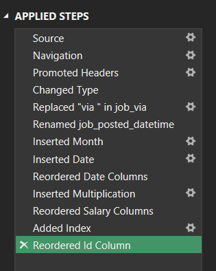
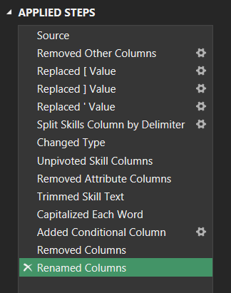
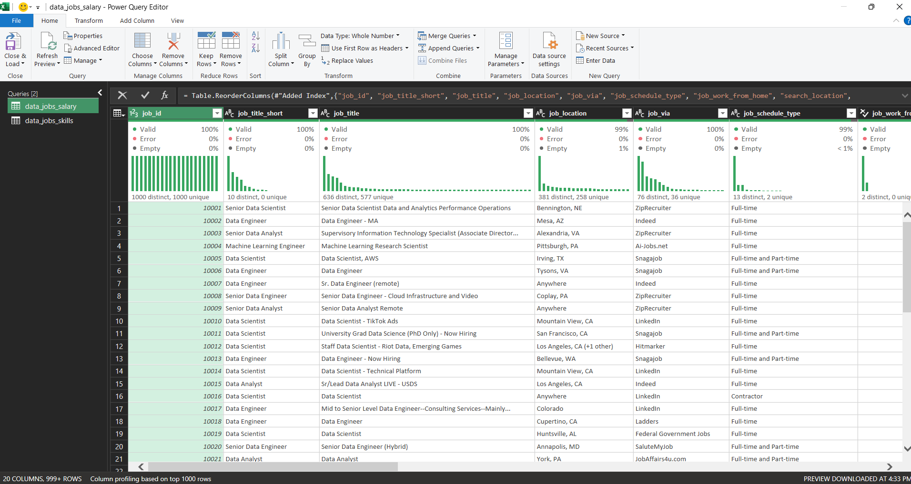
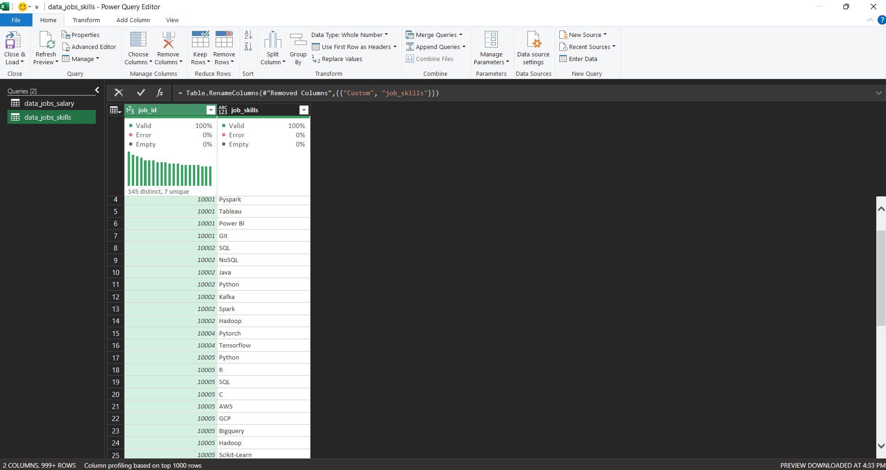
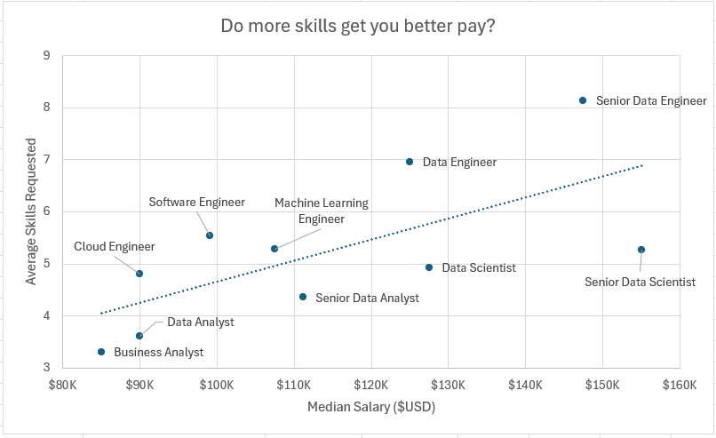
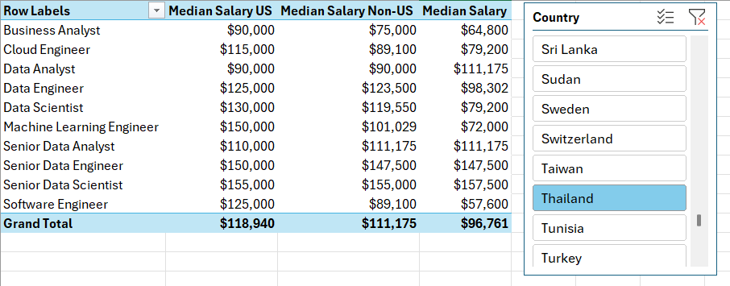
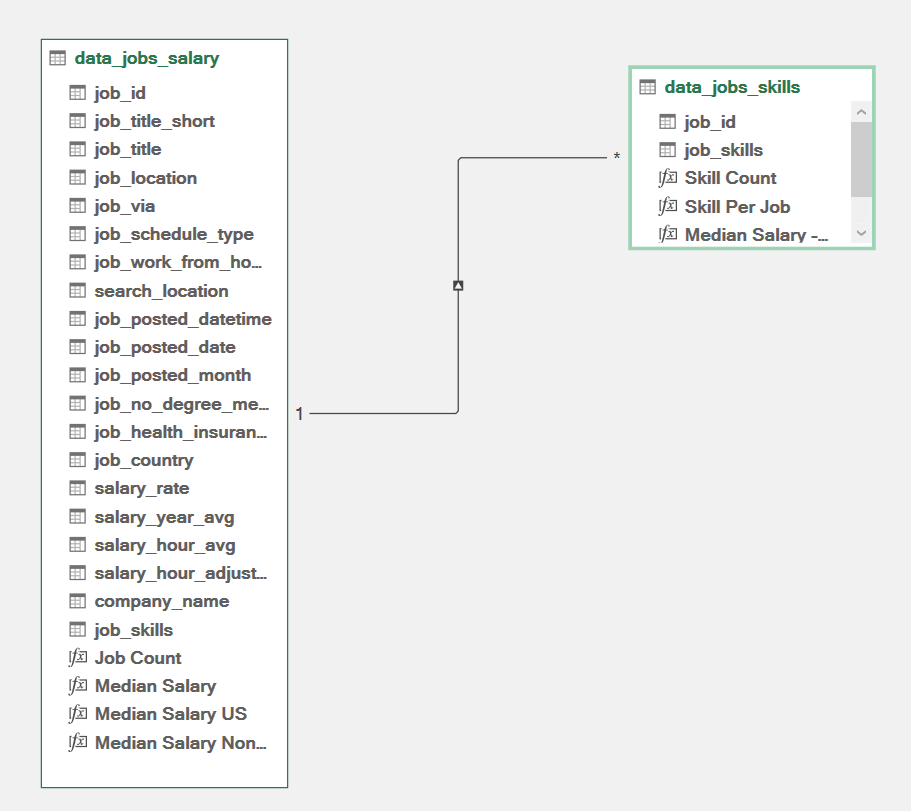
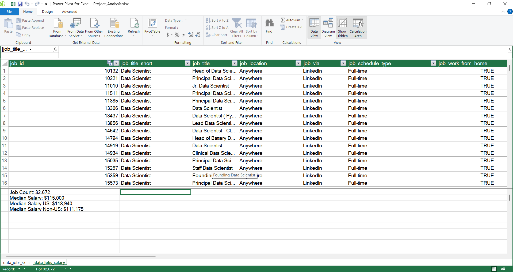
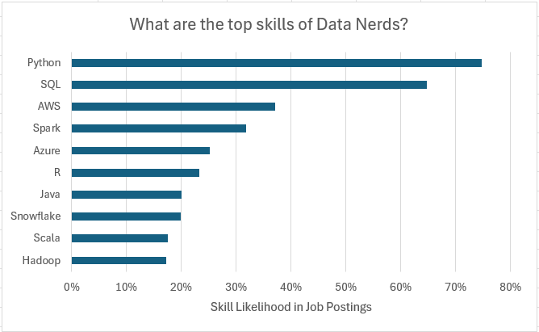
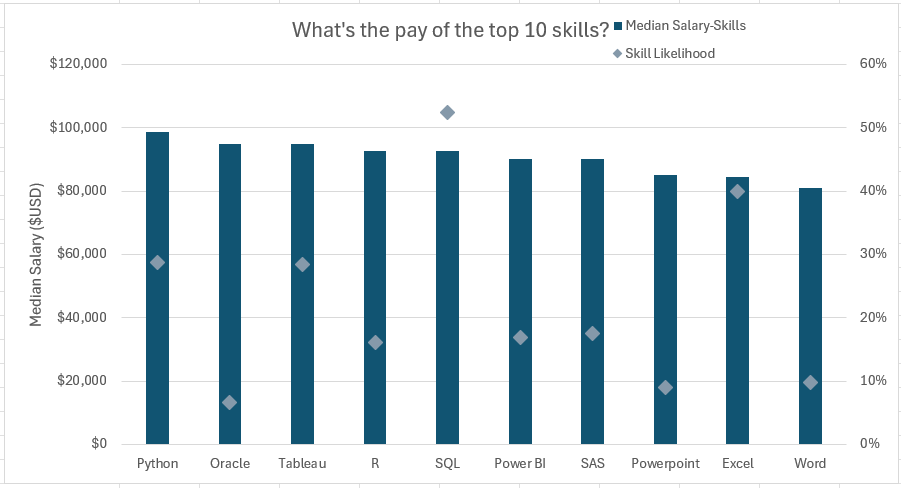

# Project Analysis

## บทนำ

ในฐานะคนที่กำลังย้ายสายงานมาสู่ด้าน Data ผมมักสงสัยอยู่เสมอว่าทักษะใดที่นายจ้างในตลาดต้องการจริง ๆ และตำแหน่งใดที่ให้ค่าตอบแทนที่คุ้มค่า
โปรเจกต์นี้จึงเป็นส่วนหนึ่งของการเรียนรู้และฝึกฝน เพื่อวิเคราะห์ข้อมูลจากตลาดงานจริง และตอบคำถามสำคัญว่า
“เราควรเรียนรู้อะไร” และ “ทักษะไหนจะช่วยเพิ่มโอกาสและรายได้ให้เราได้มากที่สุด”

### คำถามที่ต้องวิเคราะห์

เพื่อทำความเข้าใจตลาดงาน Data Science จึงได้ตั้งคำถามต่อไปนี้
1. ทักษะที่มากขึ้นส่งผลให้ได้ค่าตอบแทนสูงขึ้นหรือไม่
2. เงินเดือนของงานสาย Data ในแต่ละภูมิภาคเป็นอย่างไร?
3. ทักษะที่เป็นที่ต้องการมากที่สุดของผู้เชี่ยวชาญด้าน Data คืออะไร?
4. ระดับเงินเดือนสำหรับ 10 ทักษะยอดนิยมเป็นเท่าใด?

### สกิลของ Excel ที่ใช้

สกิลในการใช้ Excel เพื่อทำการวิเคราะห์มีดังต่อไปนี้
- 📊 Pivot Tables
- 📈 Pivot Charts
- 🧮 DAX (Data Analysis Expressions)
- 🔍 Power Query
- 💪 Power Pivot

### Data Jobs Dataset

Dataset ที่ใช้ในโปรเจกต์นี้ประกอบด้วยข้อมูลตำแหน่งงานด้าน Data Science จากโลกจริงในปี 2023 โดยสามารถเข้าถึงชุดข้อมูลนี้ได้ผ่านคอร์สเรียน Excel โดย [Luke Barousse](https://www.youtube.com/watch?v=pCJ15nGFgVg&t=17400s) ซึ่งเป็นพื้นฐานสำหรับการวิเคราะห์ข้อมูลด้วยโปรแกรม Excel ชุดข้อมูลนี้ประกอบด้วยรายละเอียดที่ครบถ้วนเกี่ยวกับ

- 👨‍💼 Job Titles
- 💰 Salaries
- 📌 Locations
- 🛠️ Skills

## ❓ ทักษะที่มากขึ้นส่งผลให้ได้ค่าตอบแทนสูงขึ้นหรือไม่?

### 🔍 **Skill: Power Query (ETL)**

#### 📥 Extract

- เริ่มต้นผมได้ทำการใช้ Power Query เพื่อดึงข้อมูลจากไฟล์ต้นฉบับ (data_salary_all.xlsx) โดยสร้าง Query แยกเป็น 2 ชุด

    - 🗃️ Query แรกเป็นชุดที่เก็บข้อมูลของ Data Jobs ทั้งหมด

    - 🔧 Query ที่สองเป็นชุดข้อมูลของ Skills ในแต่ละ Job ID

#### 🔄 Transform

- จากนั้นผมได้ทำการแปลงข้อมูลในแต่ละ Query โดยการปรับประเภทของข้อมูลในแต่ละคอลัมน์ให้เหมาะสม ลบคอลัมน์ที่ไม่จำเป็นออก ทำความสะอาดข้อความโดยลบคำเฉพาะที่ไม่เกี่ยวข้อง และจัดการช่องว่างที่ไม่จำเป็นเพื่อให้ข้อมูลสะอาดและพร้อมใช้งานต่อ

    - 📊 data_jobs_all

        - 

    - 🛠️ data_job_skills

        - 

#### 🔗 Load

- จากนั้น ผมได้ทำการโหลด Query ที่ได้ทำการแปลงข้อมูลแล้วลงสู่ Work Book เพื่อเป็นพื้นฐานในการวิเคราะห์ในขั้นตอนต่อไป

    - 📊 data_jobs_all

        

    - 🛠️ data_job_skills

        

### 📊 **Analysis**

#### 💡 Insights

- 📈 จากการวิเคราะห์พบว่า ยิ่งตำแหน่งงานระบุความต้องการทักษะมากเท่าใด ก็ยิ่งมีแนวโน้มที่เงินเดือนมัธยฐานจะสูงขึ้น โดยแนวโน้มนี้เห็นได้ชัดในตำแหน่งระดับสูง เช่น Senior Data Engineer และ Data Scientist

- 💼 ตำแหน่งงานที่ต้องการสกิลไม่มากอย่าง Business Analyst มีแนวโน้มการเสนอเงินเดือนที่จะต่ำกว่า แสดงให้เห็นว่ายิ่งมีสกิลหรือทักษะที่เฉพาะทางมากขึ้นก็จะมีมูลค่าในตลาดที่สูงกว่า

    


#### 🤔 So What

- แนวโน้มนี้ชี้ให้เห็นว่าการมีทักษะที่หลากหลายและสอดคล้องกับความต้องการของตลาด เป็นปัจจัยสำคัญที่ช่วยเพิ่มโอกาสในการเข้าสู่ตำแหน่งงานที่มีค่าตอบแทนสูง

## 🌍 เงินเดือนของงานสาย Data ในแต่ละภูมิภาคเป็นอย่างไร?

### 🧮 **Skills: PivotTables & DAX**

#### 📈 Pivot Table

- 🔢 ผมสร้างตาราง PivotTable โดยใช้ Data Model ที่สร้างด้วย Power Pivot

- 📊 ผมลากคอลัมน์ job_title_short ไปในพื้นที่ช่อง rows และ salary_year_avg ไปในพื้นที่ช่อง value

- 🧮 จากนั้นผมได้ทำการสร้าง Measure ใหม่ เพื่อทำการคำนวณหาค่ามัธยฐานรายได้ของงานในประเทศสหรัฐอเมริกา
    ```
    = CALCULATE (
        MEDIAN(data_jobs_all[salary_year_avg]),
        data_jobs_all[job_country] = "United States"
    )
    ````

#### 🧮 DAX

- คำนวณหาค่ามัธยฐานรายได้ต่อปีโดยใช้ DAX 

    ```
    Median Salary := MEDIAN(data_jobs_all[salary_year_avg])
    ````

### 📊 **Analysis**

#### 💡 Insights

- 💼 ตำแหน่งงานอย่าง Senior Data Engineer และ Data Scientist มีเงินเดือนมัธยฐานสูง ทั้งในสหรัฐอเมริกาและต่างประเทศ สะท้อนถึงความต้องการผู้เชี่ยวชาญด้าน Data ระดับสูงในระดับโลก

- 💰 ความแตกต่างของเงินเดือนระหว่างตำแหน่งในสหรัฐฯ และนอกสหรัฐฯ มีความชัดเจน โดยเฉพาะในสายงานเทคโนโลยีขั้นสูง ซึ่งอาจได้รับอิทธิพลจากการกระจุกตัวของอุตสาหกรรมเทคโนโลยีในสหรัฐอเมริกา

    

#### 🤔 So What

- Insight ด้านเงินเดือนนี้ช่วยให้สามารถวางแผนเส้นทางอาชีพและต่อรองค่าตอบแทนได้อย่างมีข้อมูลรองรับ พร้อมสะท้อนให้เห็นความแตกต่างตามพื้นที่ที่ควรนำมาพิจารณาประกอบการตัดสินใจ

## 🧠 ทักษะที่เป็นที่ต้องการมากที่สุดของผู้เชี่ยวชาญด้าน Data คืออะไร?

### 🔧 **Skill: Power Pivot**

#### 💪 Power Pivot

- 🔗 ผมได้ออกแบบ Data Model โดยทำการรวมข้อมูลจากสองตารางหลัก ได้แก่ data_jobs_all ซึ่งมีรายละเอียดตำแหน่งงาน และ data_jobs_skills ซึ่งระบุทักษะที่เกี่ยวข้อง เพื่อให้สามารถวิเคราะห์ข้อมูลแบบเชื่อมโยงข้ามกันได้อย่างมีประสิทธิภาพในโมเดลเดียว

- หลังจากที่ทำการทำความสะอาดข้อมูลเรียบร้อยแล้วโดยใช้ Power Query จากนั้นใช้ Power Pivot ในการสร้างความสัมพันธ์ระหว่างสองตาราง

#### 🔗 Data Model

- ผมได้สร้างความสัมพันธ์ระหว่างสองตารางโดยใช้คอลัมน์ job_id 

    

#### 📃 Power Pivot Menu

- Power Pivot memu ใช้ในการปรับปรุง Data Model ของผม และช่วยให้สามารถสร้าง Measure ได้อย่างง่ายดาย
    

### 📊 **Analysis**

#### 💡Insights

- 💻 SQL และ Python เป็นทักษะที่ครองตำแหน่งสูงสุดในสายงานที่เกี่ยวข้องกับ Data สะท้อนถึงบทบาทพื้นฐานในการประมวบผลและวิเคราะห์ข้อมูล

- ☁️ การปรากฏของเทคโนโลยีสมัยใหม่ เช่น AWS และ Azure อย่างมีนัยสำคัญ บ่งชี้ถึงแนวโน้มของภาคอุตสาหกรรมที่กำลังเปลี่ยนผ่านไปสู่ระบบ Cloud และ Big Data ซึ่งกลายเป็นทักษะสำคัญที่ตลาดแรงงานต้องการ

    

#### 🤔So What

- การวิเคราะห์ทักษะที่พบมากในตลาดงานช่วยให้ทั้งบุคลากรด้าน Data และผู้ให้บริการด้านการศึกษา สามารถพัฒนาทักษะหรือหลักสูตรให้สอดรับกับความต้องการที่แท้จริงของอุตสาหกรรม

## 💰 ระดับเงินเดือนสำหรับ 10 ทักษะยอดนิยมเป็นเท่าใด?

### 📊 **Skill: Advanced Charts (Pivot Chart)**

#### 📈 PivotChart

- ผมสร้าง PivotChart แบบผสม (Combo Chart) เพื่อแสดงค่ามัธยฐานของเงินเดือนและความน่าจะเป็นของทักษะ (%) จาก PivotTable

    - 🪙 แกนหลัก (Primary Axis): ค่ามัธยฐานของเงินเดือน แสดงผลแบบกราฟแท่งกลุ่ม (Clustered Column)

    - 👍 แกนรอง (Secondary Axis): ความน่าจะเป็นของทักษะ แสดงผลเป็นเส้นพร้อมจุด (Line with Markers)

- เพื่อปรับแต่งกราฟให้เหมาะสมยิ่งขึ้น ผมได้เพิ่มชื่อแกน (Axis Title), ลบเส้นกราฟของความน่าจะเป็นออก และเปลี่ยนจุด Marker ให้เป็นรูปเพชร (Diamond)

### 📊 **Analysis**

#### 💡Insights

- 💰  ทักษะอย่าง Python, Oracle และ SQL มีเงินเดือนมัธยฐานที่สูงกว่า สะท้อนถึงบทบาทสำคัญของทักษะเหล่านี้ในตำแหน่งงานเทคโนโลยีที่มีค่าตอบแทนสูง


- 📉 ในทางตรงกันข้าม ทักษะอย่าง PowerPoint และ Word มีระดับเงินเดือนมัธยฐานต่ำ และพบได้น้อยในประกาศงานที่มีรายได้สูง ซึ่งบ่งชี้ว่าทักษะเหล่านี้มีความเฉพาะทางน้อยและไม่ใช่ทักษะหลักในสายงานเทคโนโลยี

    

#### 🤔So What

- แผนภูมินี้ชี้ให้เห็นว่าทักษะอย่าง Python และ SQL มีความเชื่อมโยงกับตำแหน่งที่มีค่าตอบแทนสูง จึงเป็นทักษะที่ควรให้ความสำคัญในการเรียนรู้ โดยเฉพาะในสายงานเทคโนโลยี

## บทสรุป
ผมได้ทำโปรเจกต์นี้ขึ้นมาเพื่อฝึกฝนและเก็บสะสมผลงานเพื่อเข้ามาทำงานในสายงาน Data
โดยใช้ข้อมูลจากคอร์สเรียน Excel และ Workshop ของ **[Luke Barousse](https://www.youtube.com/watch?v=pCJ15nGFgVg&t=17400s)** หวังว่าโปรเจกต์นี้จะเป็นแนวทางที่เป็นประโยชน์สำหรับผู้ที่ทำงานในสาย Data และช่วยให้เห็นภาพรวมของทักษะที่จำเป็นสำหรับการเติบโตในสายงานที่มีรายได้สูง